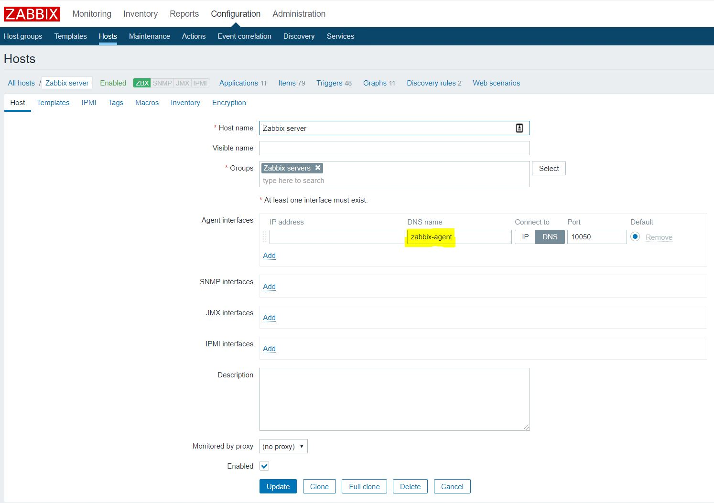

# Zabbix

## Summary
This repo holds a docker-compose file to easily set up a Zabbix monitoring environment for testing purposes.

The following containers will be  set up:
* [Zabbix server with MySQL support](https://hub.docker.com/r/zabbix/zabbix-server-mysql)
* [Zabbix web frontend with Nginx and MySQL support](https://hub.docker.com/r/zabbix/zabbix-web-nginx-mysql)
* [Zabbix agent](https://hub.docker.com/r/zabbix/zabbix-agent)
* [MySQL database](https://hub.docker.com/_/mysql)

## Requirements
[Latest Docker CE version for your platform](https://docs.docker.com/install/)

## Installation
1. Download the docker-compose.yml in this repo.
2. Run the command '''docker-compose up -d''' from the same directory as the compose-file.
3. Go to [http://localhost:80](http://localhost:80)
4. Log in with the default credentials: Admin // zabbix (mind the capital 'A').
5. Go to Configuration -> Hosts -> Zabbix server.
6. Change the 'Agent Interface' DNS-name to 'zabbix-agent' and at 'Connect to' select 'DNS':

7. Check the official Zabbix docs for more configuration options [here](https://www.zabbix.com/documentation/4.2/manual).
